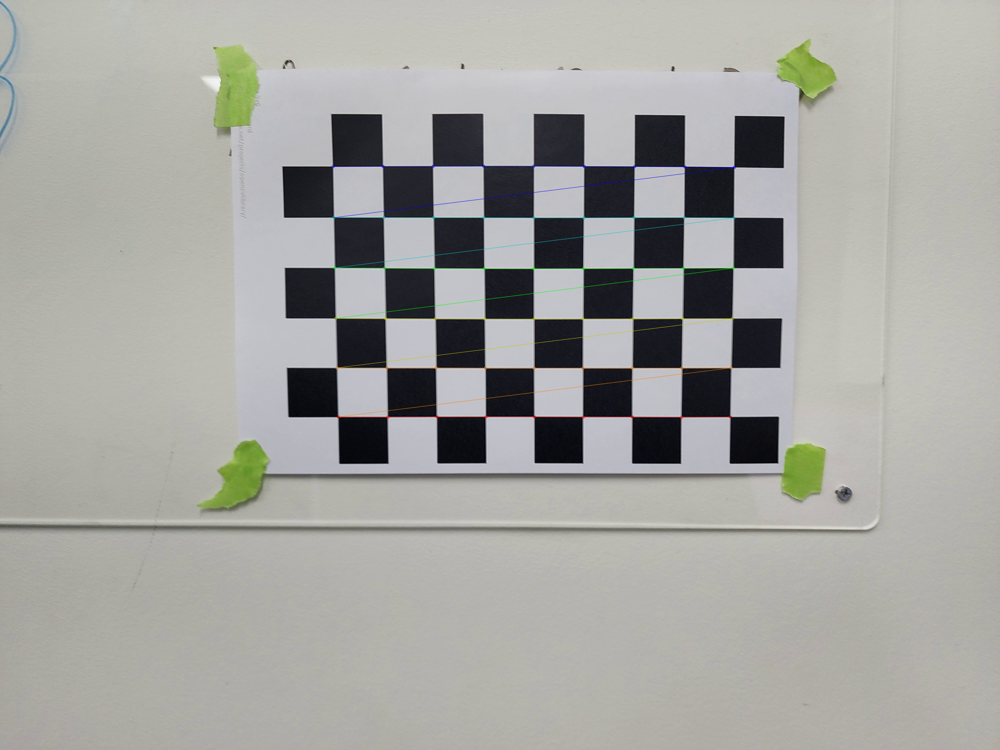
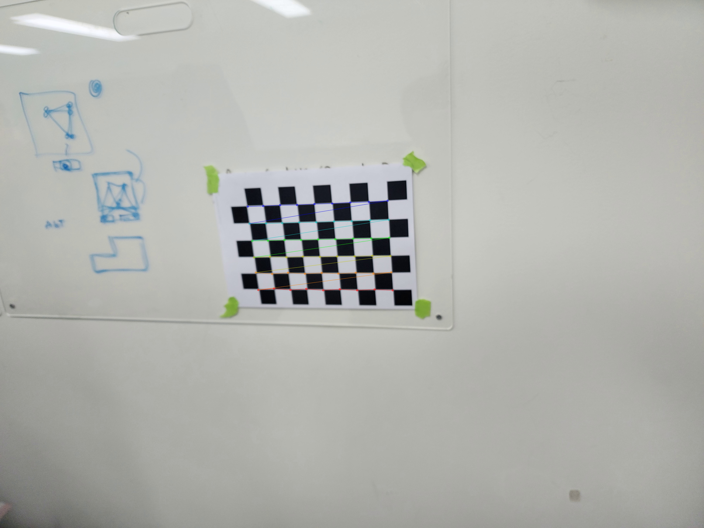
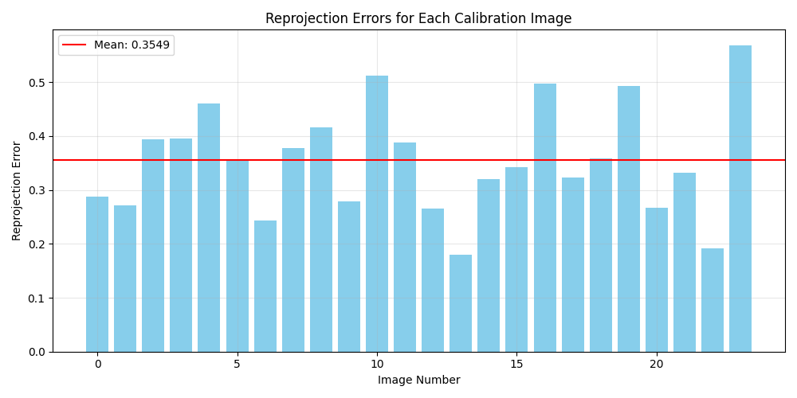

# OpenCV Python based camera calibration

[]() 


<p align="center">
 
 
 
 
 </p>

<p align="center">
 
 
 
 <br>
</p>


# Features

## Corner Detection

<table>
    <tr>
        <td></td>
        <td></td>
    </tr>
    <tr>
        <td></td>
        <td></td>
    </tr>
</table>

## Undistortion Images


## Calculate Reprojection Errors



## Show histogram Errors


## Calibration Results

```json
{
    "reprojection_error": 1.2273468645903203,
    "camera_matrix": [
        [
            1422.117605057742,
            0.0,
            924.5633003737133
        ],
        [
            0.0,
            1423.204374674482,
            667.6183041323897
        ],
        [
            0.0,
            0.0,
            1.0
        ]
    ],
    "dist_coeffs": [
        4.612616555464993,
        152.56623164609113,
        0.039943271525320366,
        -0.008947777240770066,
        -228.0106478053562,
        4.592880469213394,
        151.6208067211176,
        -221.65838356166944,
        0.0010495594571102234,
        0.011289450598695816,
        -0.038397785485157175,
        -0.03986920764202555
    ]
}
```


# Environment
    conda create -n calib python=3.11

    pip install -r requirements.txt

# How to use

1. **Print** Checkerboard images (assets/checkerboard.png) to A4 
    

2. **Recording** and then move video file to **assets/calibration_video.mp4**

3. **Extract** video frames
    ```bash
    python extract_video.py
    ```


4. **Run** calibration
    ```bash
    python camera_calibration.py # simple run

    python camera_calibration_high.py # Best quality
    ```